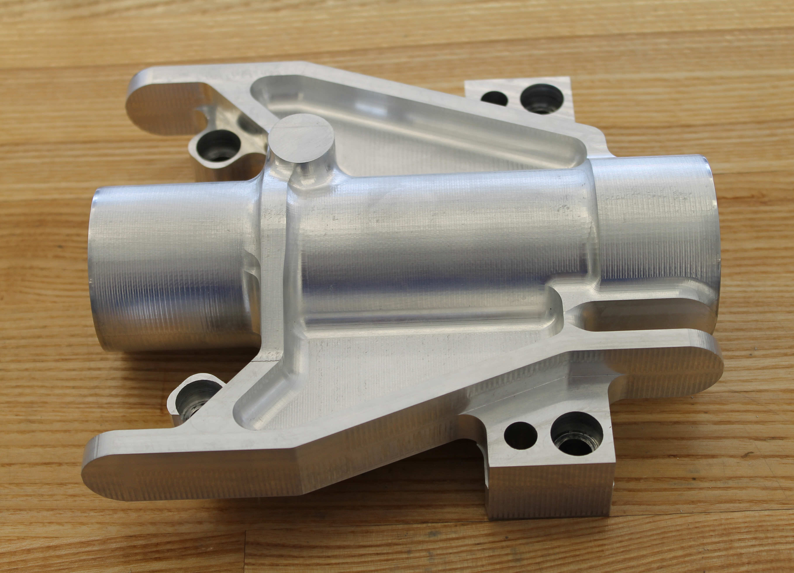
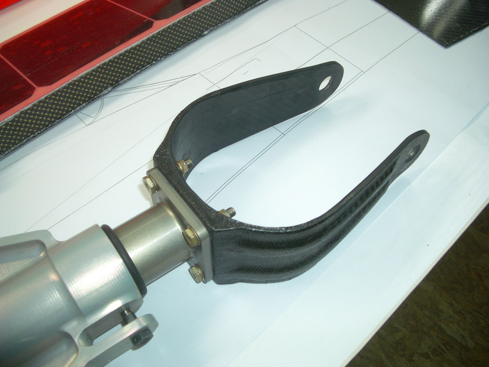
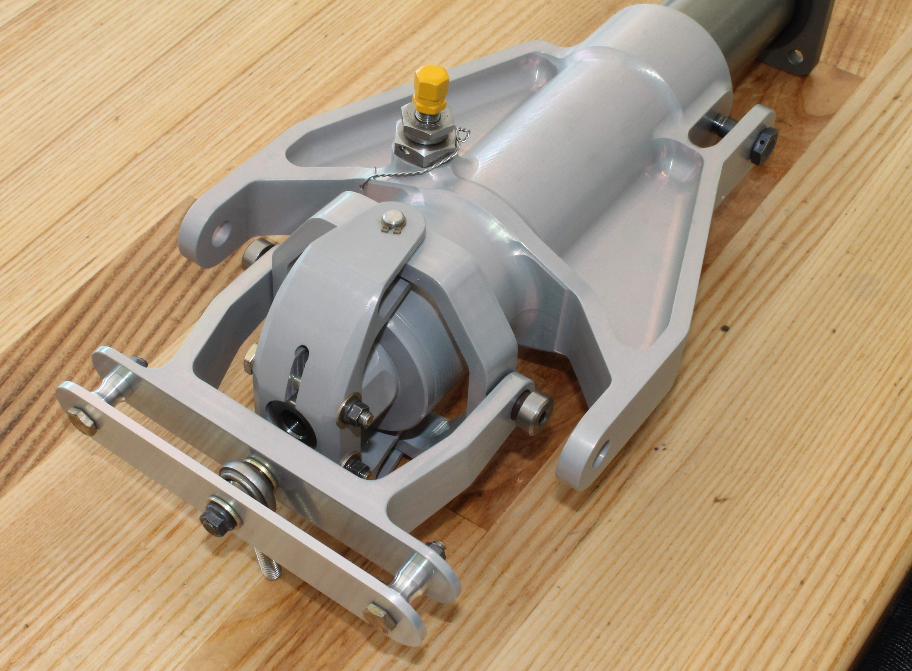
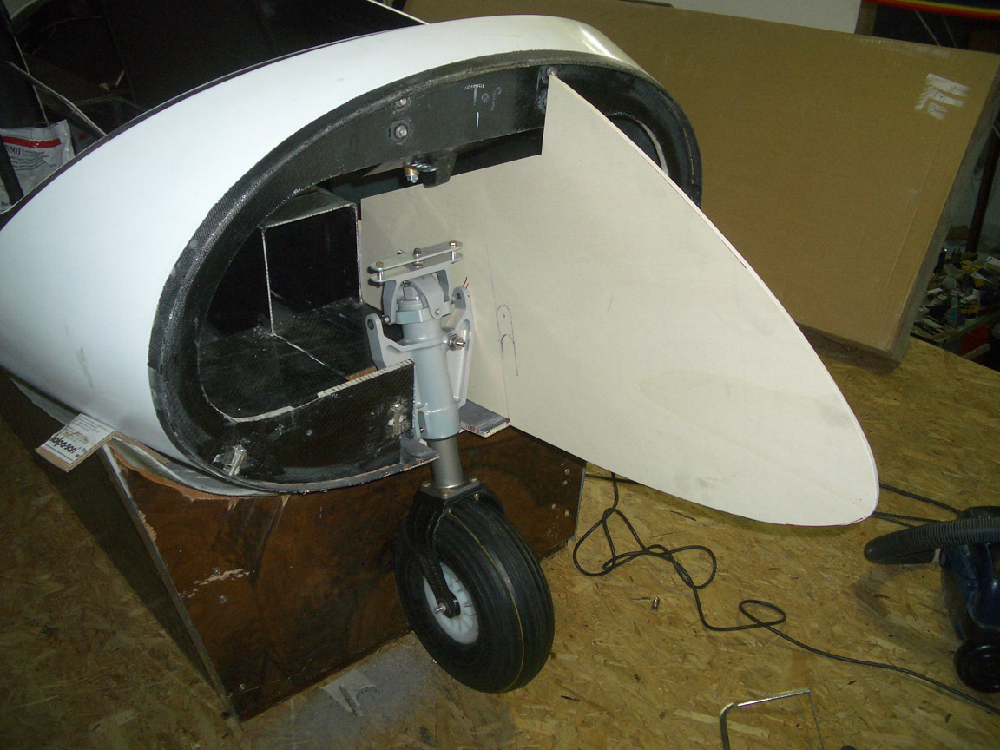
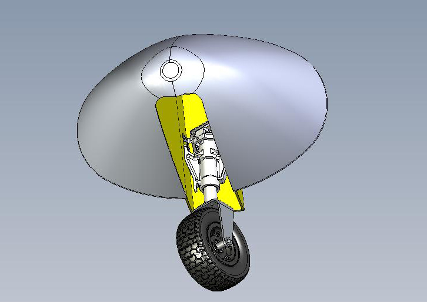
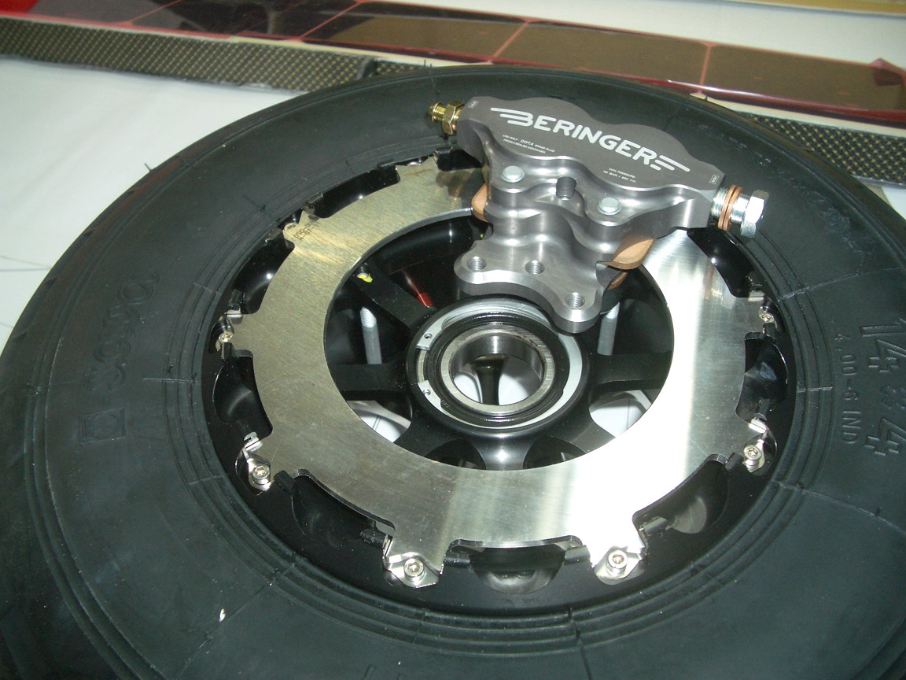
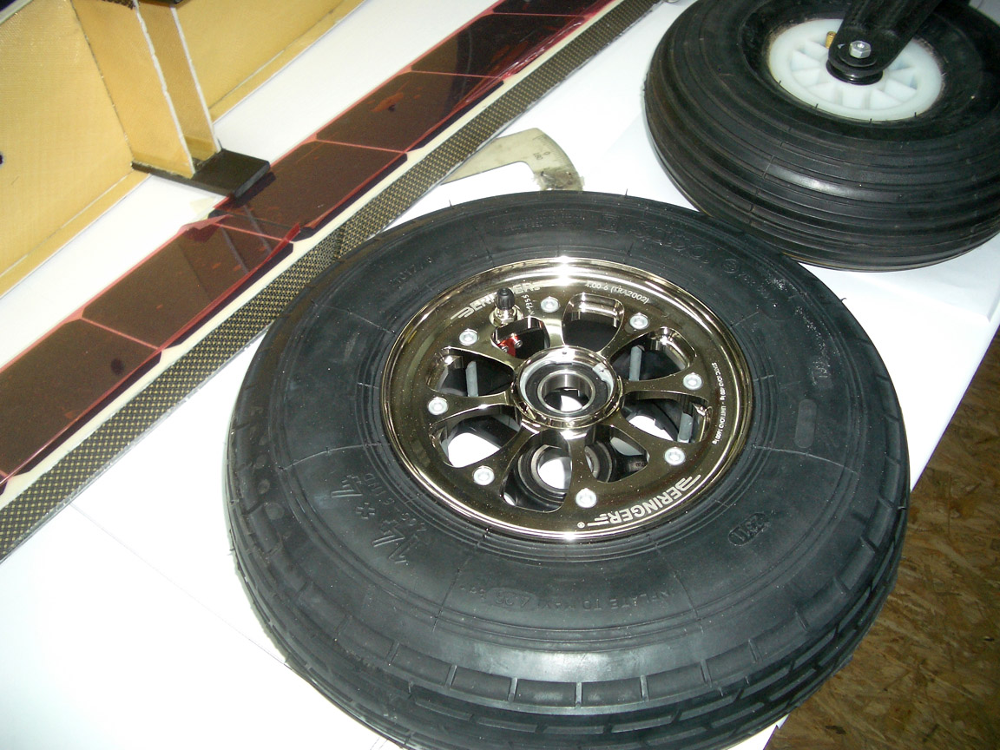

---

title: November 5, 2011
tags: home, duo
template: article.jade

---

The Sunseeker Duo is truly an international effort.  Consider that the fuselage was  molded at Allstar Gliders in Poland. With extensive support from Germany and Slovenia, the project is  gathering momentum. Construction moves ahead, with high quality parts as the rule.

Here we introduce the engineering effort on the nose gear from our friends in Santa Paula, California.

The nose gear is a crucial assembly, requiring shock absorbtion, steering, and retraction, all in a reliable light weight package. Rick McWilliams (http://www.tangentinstruments.com/)designed the trouble free nose gear for the Mermaid amphibian, so he got the job of designing our nose gear under very demanding weight and space constraints.

Partnered with him is John Lynch, whose shop is also at the Santa Paula Airport, to turn the computer files into parts.  While most of the parts of the new plane are composite, this assembly will utilize aluminium. The shock absorber is integrated co-axially into the strut to save weight.  A carbon pre-preg fork will be tested with the assembly, attaching to the nylon wheel.

