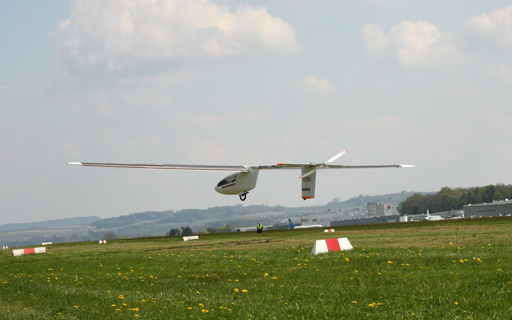
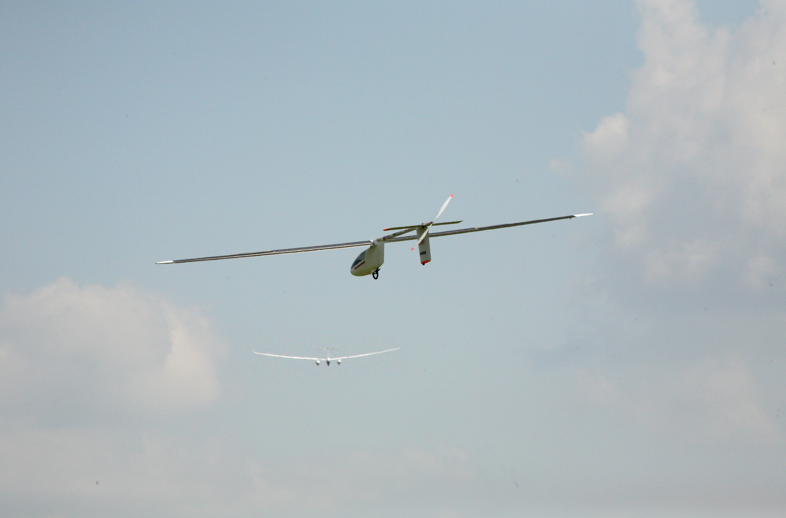
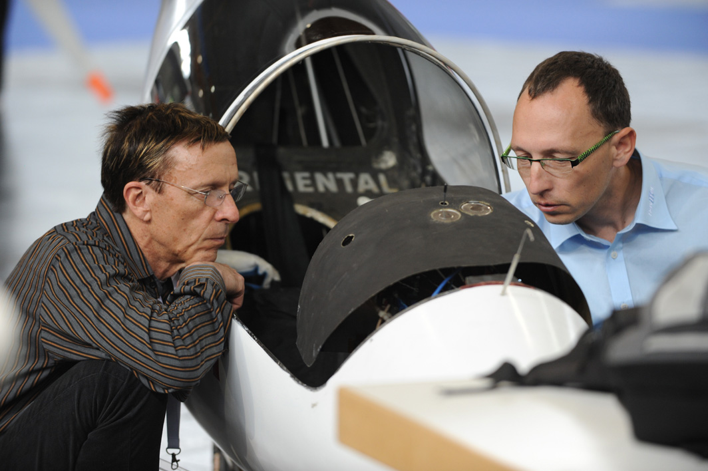
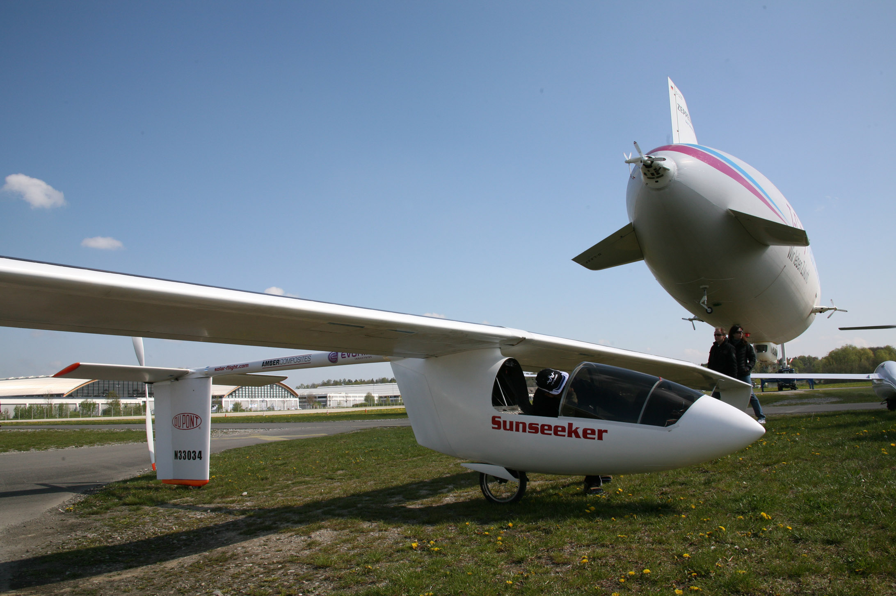
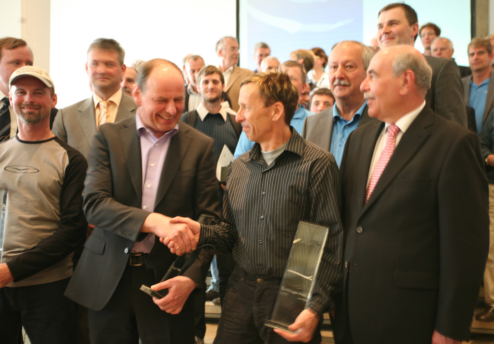
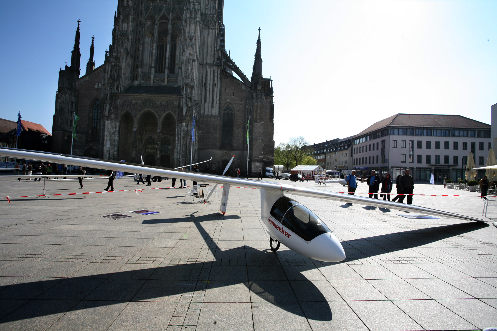

---

title: April 17, 2011 - Sunseeker II Wins Berblinger Prize
tags: home, log
template: article.jade

---

Held this year in conjunction with the largest airshow in Europe, AERO in Friedrichshafen, Germany is now history.   The winners were chosen from the pilots who completed the flight task, to Ulm and back.  As the planes competing were so different, the judges chose three winners, each from a different class.

Solar Flight received 45,000 Euros for the SUNSEEKER II. Axel Lange also received 45,000 Euros for his production Antares motor glider. In the ultralight catagory, Manfred Ruhmer won 10,000 Euros with his electric SWIFT. Find more info about the berblinger prize here:     http://www.berblinger.ulm.de/html/press_pm

