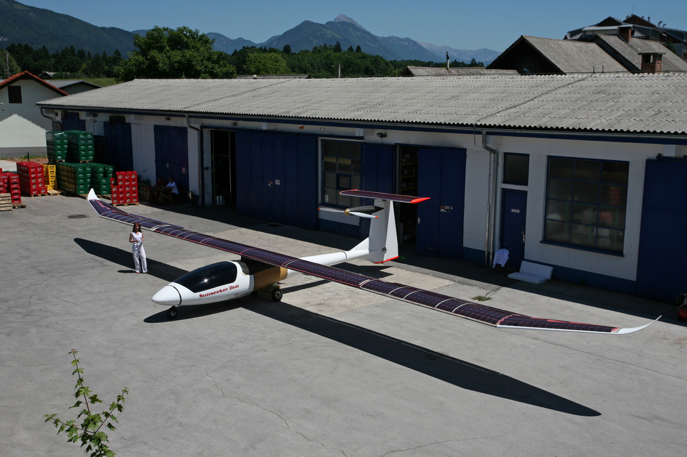
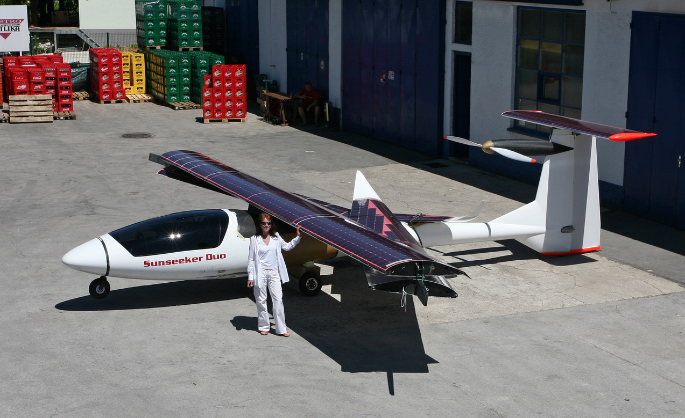
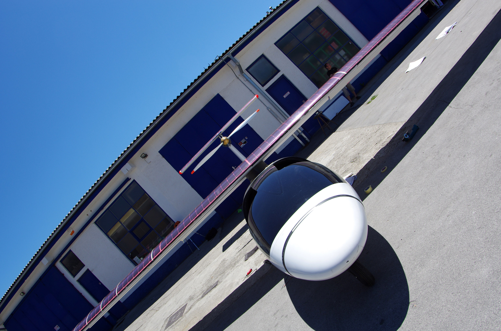

---

title: Rollout of Sunseeker Duo
date: June 17, 2012
tags: duo

---

Today we assembled the major components of Sunseeker Duo out on the ramp for the first time. There is a lot of work left to do, but it is encouraging to see the ship start to look like an airplane! Compared to the original Sunseekers, the Duo is a giant. The switchblade function of the wings reduce its /Users/estk/Downloads/SolarFlightSunseekerDuo.mdfootprint to a managable size for hangar storage. 

