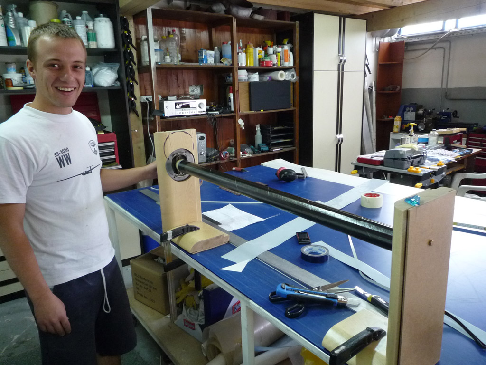
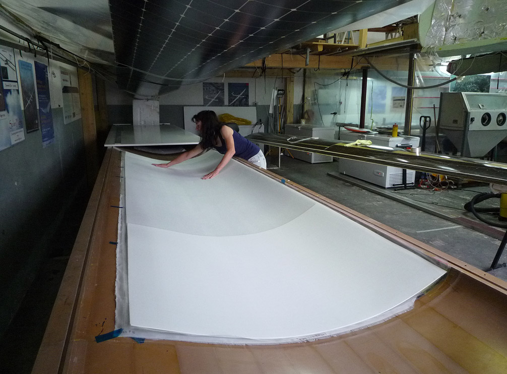
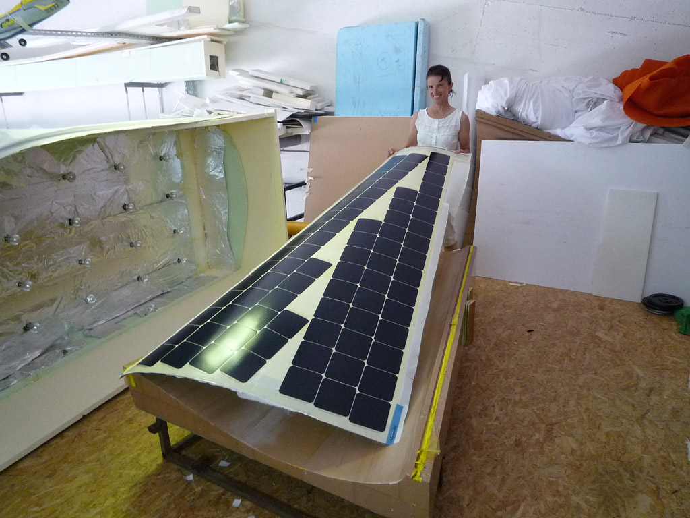
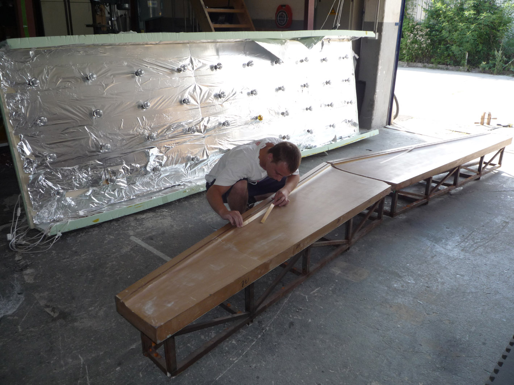
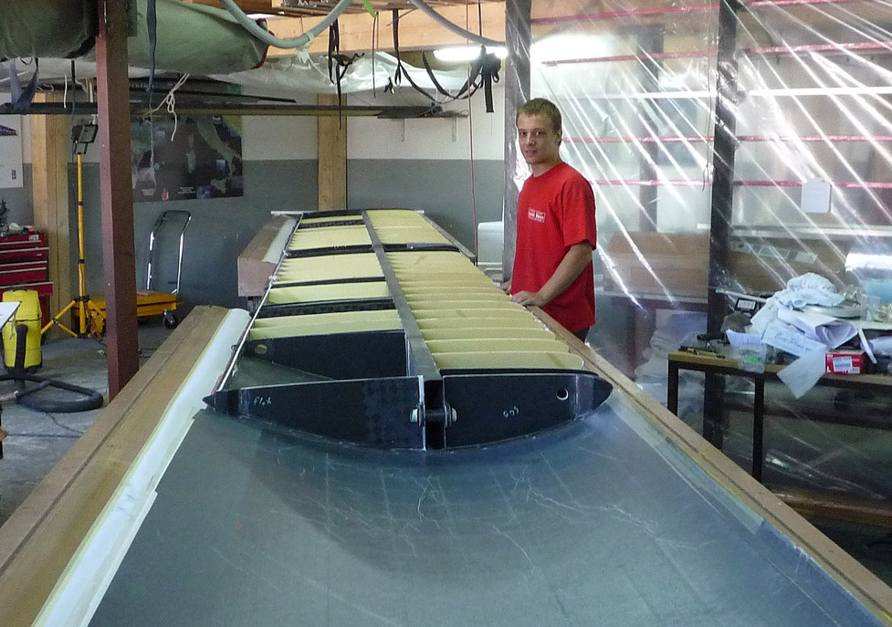
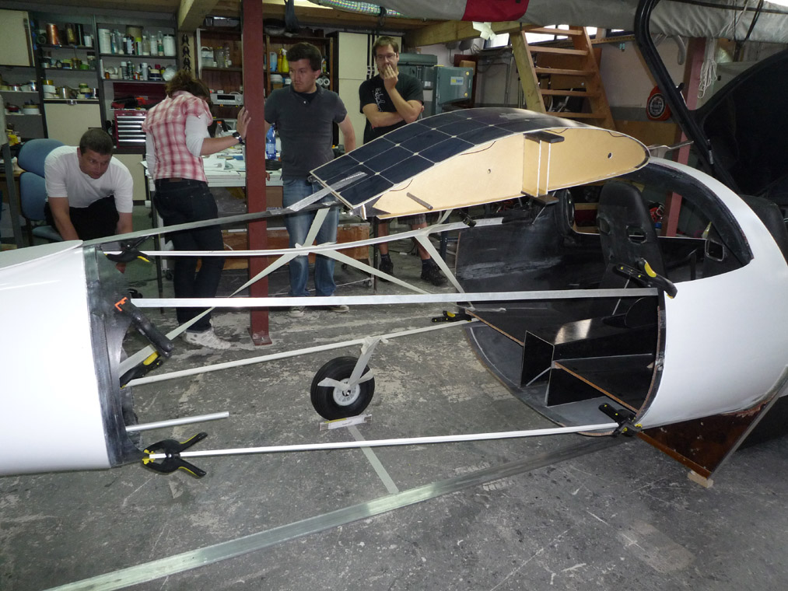

---

title: Wing and Fuselage Center Section Construction
date: August 14, 2011
tags: duo

---

With help from our new team member, Peter Stegovec, we are making good progress, concentrating on the wing at the moment. Karl Kaser leads the engineering team starting work on the center section and main landing gear.

