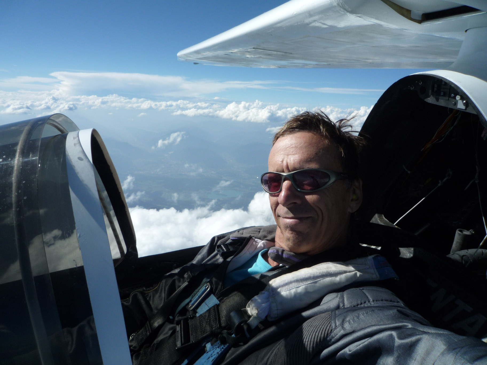
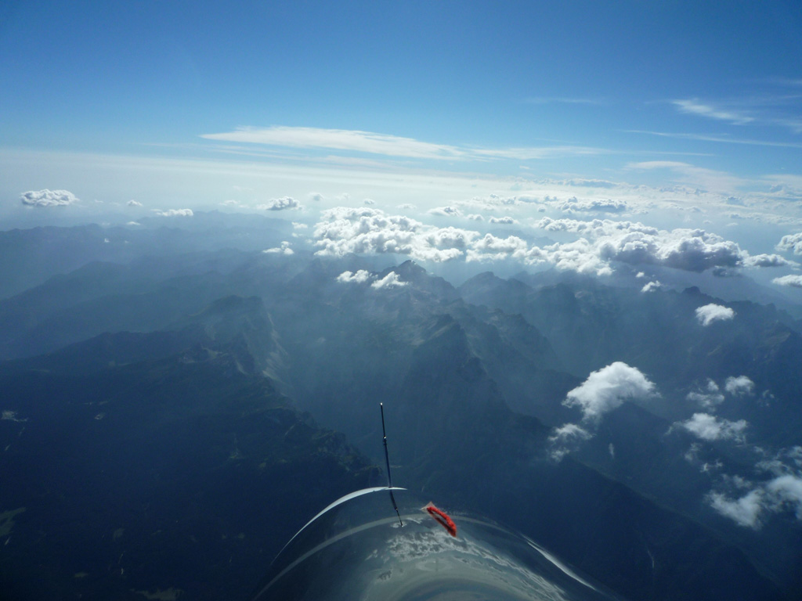
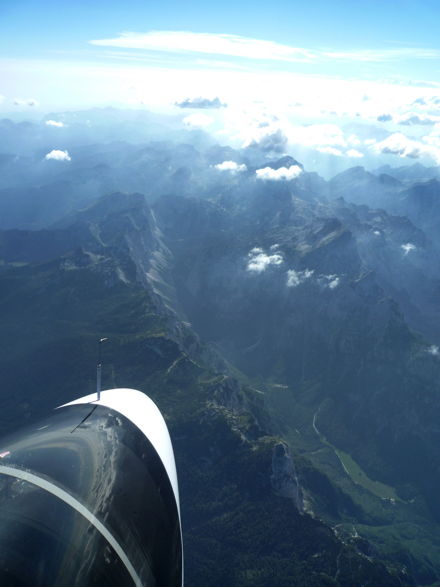

---

title: August 6, 2012
tags: home, log
template: article.jade

---

With south winds here in Slovenia, we have the chance for mountain waves.  I flew around for almost four hours finding nothing, even though there were lenticulars overhead.  I even motored us to 12,000 ft, looking for wave lift.  I finally gave up and headed out over the airport, but then I found wave lift right over the runway.  With 32 knots of wind showing on my GPS, I slowly crabbed over to Triglav Mountain, while climbing to over 15,000 ft.  It is a strange feeling to be downwind of such big mountains in such strong wind, but it was perfectly smooth. 

