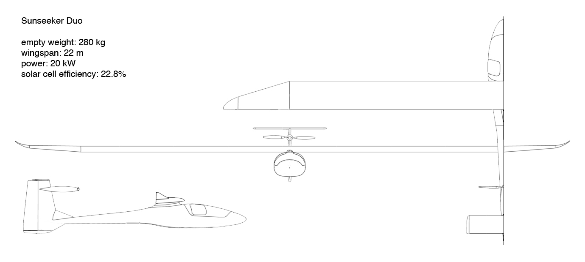

---

title: Sunseeker Duo

---

Flight testing of Sunseeker Duo is underway. The goal is to acheive maximum performance without using fossil fuels. Not only is the Duo the fastest solar-powered airplane ever built; it is the first solar powered airplane to offer a seat for passengers. The Duo incorporates all of the best features of the other Sunseeker aircraft and adds many refinements, as well as improved technologies. The solar cells used by the Duo are 50% more efficient than those used by Sunseeker II. While Sunseeker II is able to cruise in level flight on direct solar power, the Duo will have enough power to maintain a steady climb on direct solar power. The tricycle landing gear arrangement, familiar to all pilots, ensures that the Duo will operate normally at any airport in the world and folding wings give the airplane a hanger footprint no larger than a Cessna 172. The airplane can also be quickly disassembled and packed into a custom trailer.

The Sunseeker Duo realizes Solar Flight’s dream of a practical, high performance, 2-place solar powered airplane. With the US and Western Europe already well explored by Sunseekers I and II, Solar Flight is looking towards the dramatic landscapes of Eastern Europe and Western Asia for possible expeditions with the new airplane. Whether it is a day of local flying above the clouds, or a trans-continental adventure freed from the constraints of fossil fuels, the Sunseekers are ready. 

