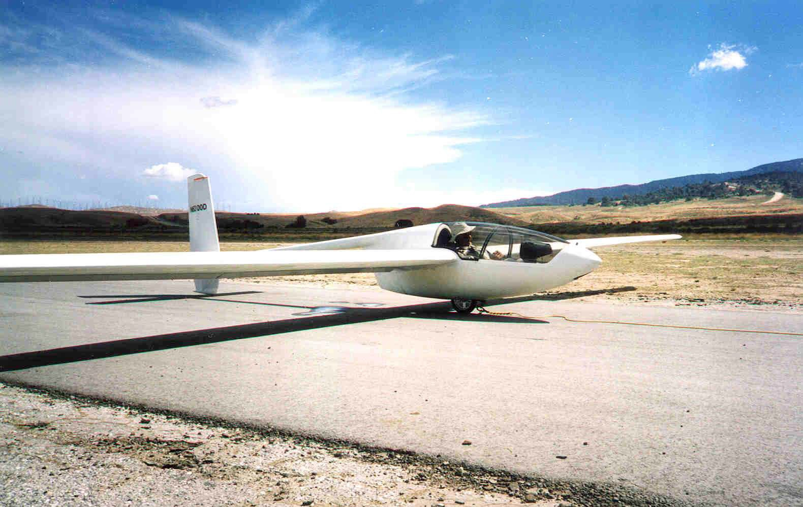
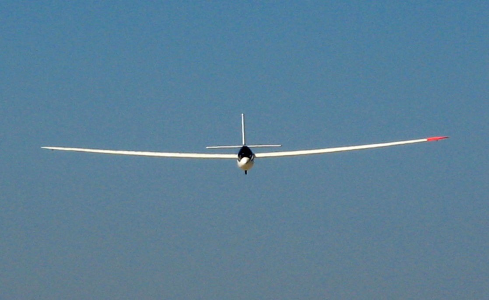

---

title: Edelweiss
published: true
rank: 4

---

The Edelweiss was the second airplane produced by Solar Flight. It was built in response to a debate as to whether it was possible to construct a high performance sailplane that weighed less than the ultralight category weight limit of 154 pounds. AlthoughSunseeker I was initially flown as a glider with an empty weight of only 100 lbs, it was considered too fragile to be practical. More durability was built into the Edelweiss, with less wing span for better maneuverability and a higher top speed. It is designed for a top speed of 120 knots and is fully aerobatic. One of its design features is the inclusion of water ballast tanks in the wings, capable of carrying 150 lbs of water. The wings were load tested to 6.6 g before flight testing.

