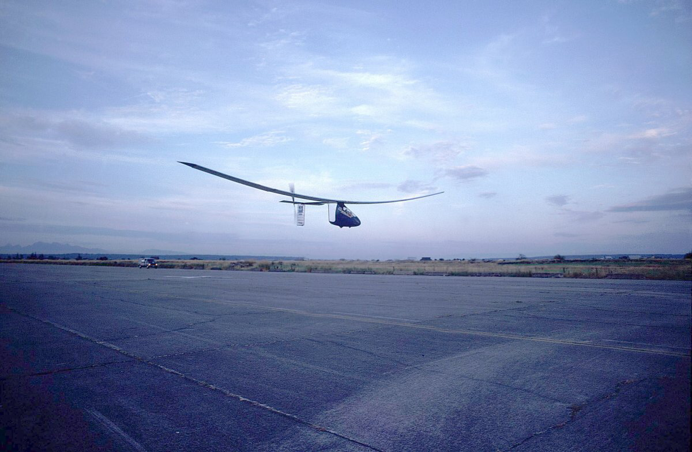
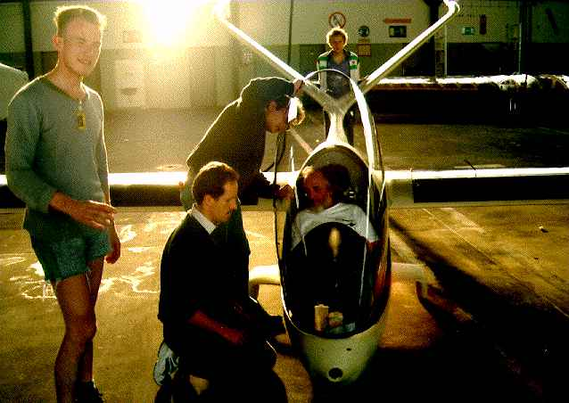

---

title: Günther Rochelt
published: true
rank: 2

---

After a successful hang gliding career and constructing several of his own gliders Eric Raymond was invited by Rochelt to fly his human powered airplane, Musculair II. Musculair II was groundbreaking in its simplicity and to this day remains the fastest human powered aircraft ever built. With Rochelt's encouragement, Raymond conceptualized the original Sunseeker. The configuration was based on that of Musculair II and Rochelt passed on the novel construction techniques that he used to acheive phenomonally lightweight, yet robust structures.

In addition to the serious of human-powered airplanes, Rochelt built two significant solar-powered ships.
Solair 1 was based on a Hans Farner canard design. It employed 2499 wing-mounted solar cells giving an output of between 1.8 and 2.2 kW. The aircraft first flew at Unterwössen, Germany on 21 August 1983. It flew for 5 hours and 41 minutes. The airplane is now displayed at the German Museum in Munich  Rochelt's second solar-powered airplane, Solair II, made its first flight in May 1998 and further test flights that summer, but the propulsion system overheated too fast and development stopped when Günther Rochelt suddenly died in September 1998. More information about Rochelt's many projects can be found at <a href="http://www.solair.de">solair.de</a>

Solar Flight's efforts are dedicated to the memory of Professor Günther Rochelt.

<iframe src="http://player.vimeo.com/video/14810957?title=0&amp;byline=0&amp;portrait=0" width="500" height="281" frameborder="0" webkitAllowFullScreen mozallowfullscreen allowFullScreen></iframe> 
<a href="http://vimeo.com/14810957">Solair I</a> from <a href="http://vimeo.com/user3563715">Eric Raymond</a> on <a href="http://vimeo.com">Vimeo</a>.

<iframe src="http://player.vimeo.com/video/14809359" width="500" height="281" frameborder="0" webkitAllowFullScreen mozallowfullscreen allowFullScreen></iframe> 
<a href="http://vimeo.com/14809359">Public Flight Demonstration of the Musculair I</a> from <a href="http://vimeo.com/user3563715">Eric Raymond</a> on <a href="http://vimeo.com">Vimeo</a>.

