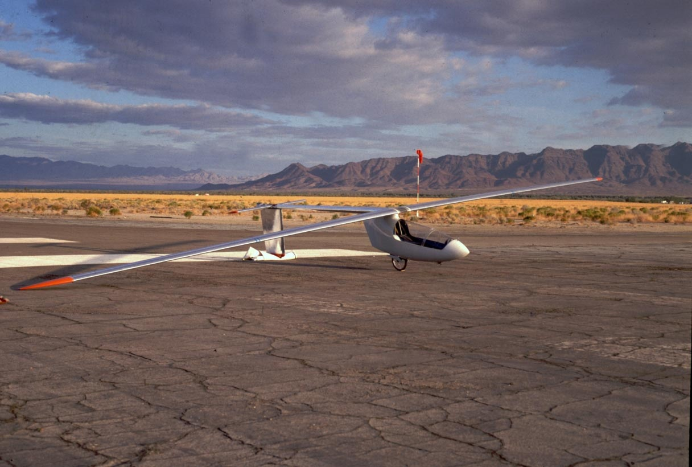
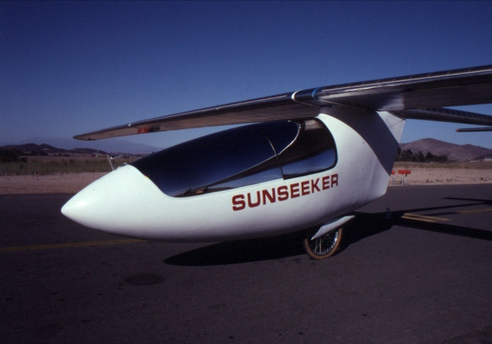
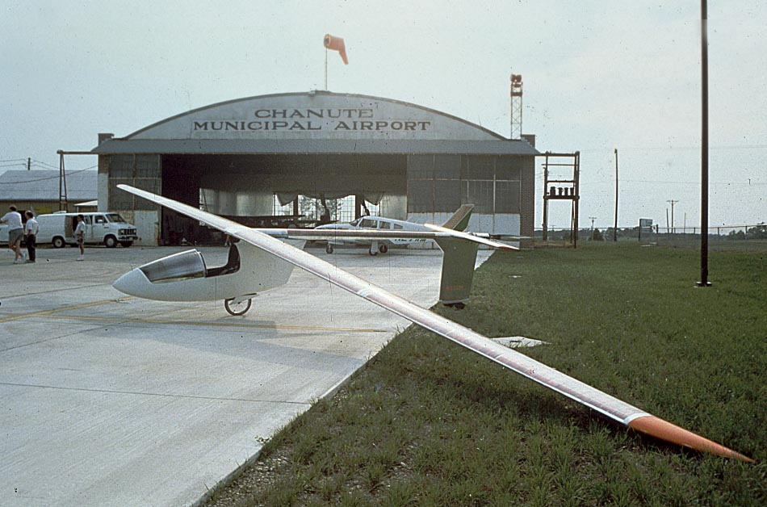

---

title: Sunseeker I
published: true
rank: 3

---

Solar flight was established to further the development of solar powered and electric sport aircraft. Eric Raymond's dream of solar powered flight began in 1979, when Larry Mauro demonstrated his solar powered ultralight glider, named Solar Riser. 1981's debut of Paul MacCready's Solar Challenger added credibility to the concept. The revelation, after flying Günther Rochelt’s Muculair II, that a fast, streamlined aircraft could be built for incredibly low weight was the impetus that led to the construction of the Sunseeker. Design of Sunseeker I began in 1986. Progress was slow until 1988, when support was found in Japan. With the help of several corporate sponsors. Sunseeker I was test flown at the end on 1989 as a glider. 

In early 1990 battery powered flights were made with two brush motors driving a variable pitch prop, which could be feathered for gliding. The motor and prop mechanism were not satisfactory, so an A.C. brushless motor and a folding prop were installed. 

##Across America
After many long test flights, a series of flights were initiated across the country. During August of 1990, The Sunseeker crossed the United States in 21 flights, with 121 hours in the air.

