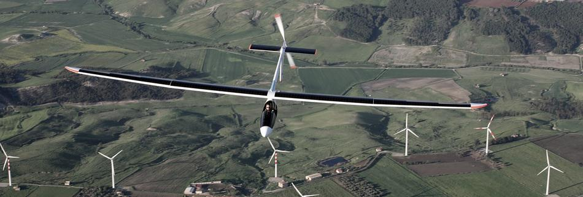
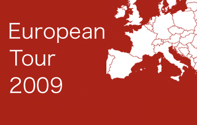
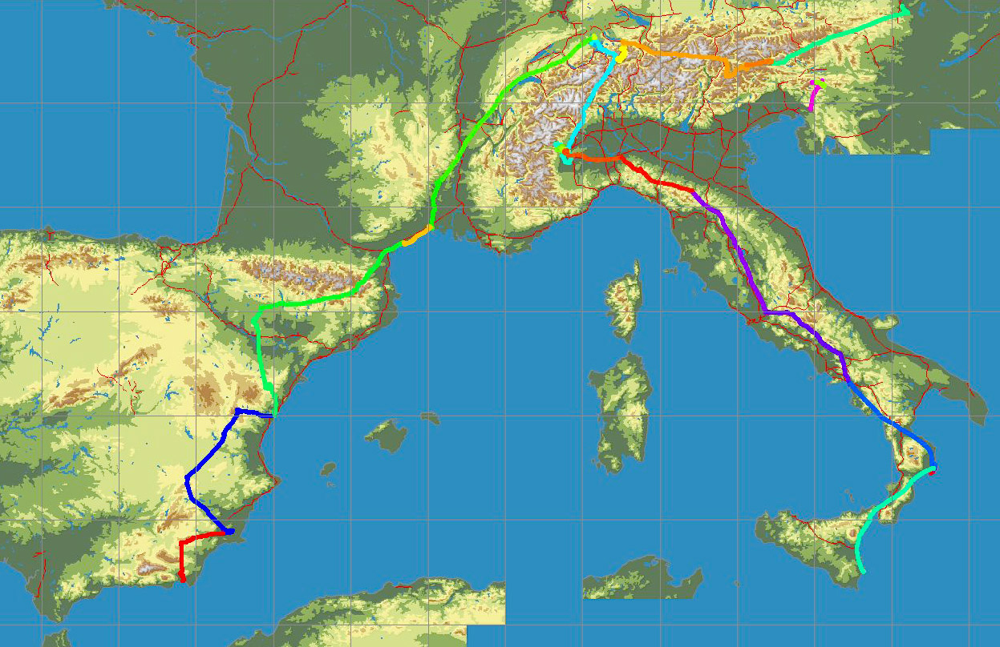
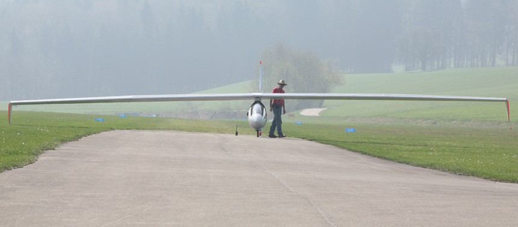
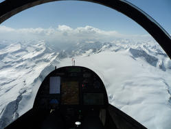
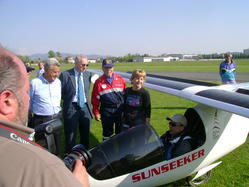

---

title: Sunseeker II
published: true
rank: 4

---

In 2006 many improvements to the original Sunseeker were completed. The new airplane, dubbed Sunseeker II, featured a redesigned wing with more area for solar cells, a more powerful motor, new lithium polymer batteries, and an updated electrical system. In 2009, again with Eric Raymond in the cockpit, Sunseeker II completed a vast flying tour of Europe. The tour began with the first crossing of the Alps every made by a solar powered airplane and continued down the length of Italy to Sicily, followed by a route along the Dolomites through Austria and Slovenia, and finally a journey through the South of France and Spain ending at Spain’s southern coast.  

<a href="http://solar-flight.com/europetour/">European Tour 2009 site</a>

Sunseeker I and II have logged, by a huge margin, more flight hours than any other solar powered airplane. The Sunseeker, unlike other solar powered aircraft that have been flown in ideal conditions under strict ground supervision, is the only solar powered aircraft to have been tested and proven in continuous real world operations. 

##First Alps Crossing

99 years after the first crossing of the Alps in an airplane by Geo Chávez flying a Blériot XI, Eric Raymond completed the first crossing of the Alps made by a solar-powered airplane flying Sunseeker II.

"It was one of the most difficult things that I have ever done, but it was also the most beautiful flight I have ever made. It was very cloudy, but after fighting to gain altitude I got over the clouds and cruised on direct solar power, eventually climbing to 13,700 ft. It was amazing to see the peaks of the mountains coming upthrough the clouds. I could clearly see the Matterhorn and Mt Blanc over the clouds. I could not see anything in the direction of Italy, except a solid wall of clouds. I tried to climb over them on course for Torino, but I had to fly between towering cumulo-nimbus clouds. I was in bright sun, when I noticed that I was flying through large snowflakes. That was the first sign of trouble. Soon I was trapped over these rising clouds, with my escape closed off. I was climbing at full power, but the clouds were rising faster. It was snowing on me, even though I was in the sun! Desperately flying around in my shrinking trap I found a small hole, where I could see the ground. Just snow and trees. I turned off the motor, set the airbrakes, and spiraled down 7000 ft, until I was just under the clouds. I wanted to take a picture of the snow, but I couldn’t take my hands from the controls. After feeling desperate about flying through clouds in a blinding snowstorm, I felt much better seeing that the clouds did not go all the way to the ground. I even flew with a sailplane and a paraglider, so I did not feel so alone. Because of the thunderstorms, I left the Alps early, and had a long crossing over the Italian flats. It seemed to take forever to get to Torino, but in reality the entire flight took less than 5.5 hours. TV crews were waiting, and we saw the story on the national news that night in our hotel, just before a nice dinner with our hosts, the organizers of the World Air Games 2009. We are now preparing to continue down the length of Italy, to Sicily."

- Eric Raymond

