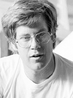

---

title: Bill Watson
rank: 20
published: true

---

A designer and builder with a long history of unique aircraft. Bill Watson is an expert in the field of airship design and construction. He served as the chief construction engineer for the Icarus HPA-1 and Gossamer Albatross human powered aircraft. He also designed and built the human powered airship White Dwarf, which set a distance record for its class with Bryan Allen as pilot and motor. He has consulted extensively with numerous companies including Boeing in the development of their own airship projects.

