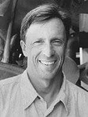

---

title: Eric Raymond
published: true

---

Eric Raymond's career in flying began at an early age, with model airplanes. Working with Paul Mac Cready, he flew the MPA Bionic Bat.   He was invited to fly Gunther Rochelt's human powered Musculair 2 and with Rochelt's help he formulated the concept for the Sunseeker. The Sunseeker went on to break all previous records for solar powered aircraft. Raymond studied aeronautical engineering at University of California San Diego. From 2003 - 2007 he worked with AeroVironment on classified projects building unmanned aircraft for the U.S. military.

