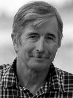

---

title: Floyd Fronius
rank: 8
published: true

---

Floyd has been involved with aeronautics for most of his life. He is the machinist who made both tooling and hardware for Sunseeker I and II. His company, Aeolus Machine, has worked on diverse aircraft from the Basic Ultralight Glider series to the Lighthawk microlift sailplane in addition to projects with Solar Flight. Floyd is an experienced pilot with many hours spent flying hang gliders and unique ultralight aircraft including Solar Flight's Edelweiss sailplane. He was also a crewmember for the 2009 European Tour with the Sunseeker II.

