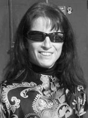

---

title: Irena Raymond
rank: 2
published: true

---

Aviation is a life long passion of Irena's. She was born in the foothills of the Julian Alps, near the Lesce airfield, and spent her childhood visiting the airfield often to watch airplanes fly. She earned her sailplane license when she was only 16, the youngest age allowed in Slovenia. After earning Faculty of Chemistry and Chemical Technology from the University of Ljubljana, Irena worked at Sava Krani engineering rubber compounds for more efficient tires. When Goodyear acquired the firm, Irena worked as a project manager and head of raw materials procurement. In 2005 Irena was selected as the President of the Slovenian Women Pilots Association, an organization dedicated to encouraging women’s participation in aviation in Slovenia and around the World. Irena met Eric Raymond when he was invited to speak at a SWPA event – it was love at first flight! Today Irena is dedicated to the Sunseeker Duo endeavor. She manages the day-to-day operations at Solar Flight.

