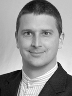

---

title: Karl Kaeser
rank: 10
published: true

---

Mechanic, engineer, German; Karl Kaeser specialized in aircraft design, lightweight structures, and fluid dynamics at the University of Stuttgart. His vast experience encompasses some of the most innovative aircraft companies in the world, including Stemme AG, Rupert Composites, Yuneec and Solar Impulse. Karl led the design effort for the fuselage center section of Sunseeker Duo. He is also responsible for the development of a safety feature that could benefit all electric aircraft. His mechanism provides a soft-start for the motor and stops the propellor immediately if it encounters any obstacles, protecting bystanders. The Sunseeker Duo will be the first airplane to implement this feature.

