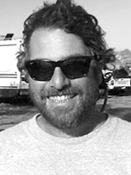

---

title: '"RC" Dave Freund'
rank: 9
published: true

---

David is a designer and builder of light-weight aircraft structures. In addition to working as a shop manager at AeroVironment, Freund worked extensively with Eric Raymond and Bill Watson on the development of the Sunseeker from the initial concept through its flight testing. He was also a member of the team of pilots who flew Alan Cocconi’s solar-powered SoLong UAV for its 48 hour record, the first airplane to complete an autonomous day-night cycle.

